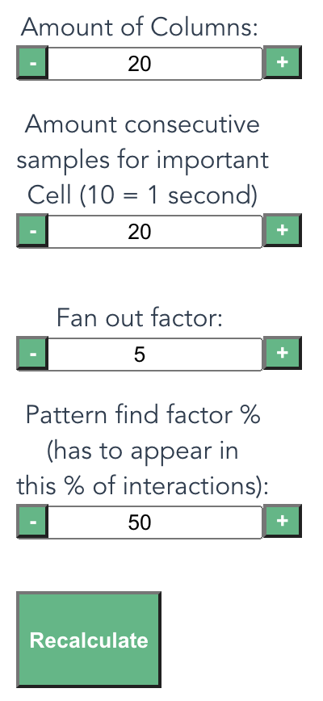

# UI-Fingerprint Pattern Detection
This project is a prototype of utilizing the fingerprint based recognition algorithm used in the Shazam-application to recognize patterns in user interactions on a website. The idea is to capture eytracking signals to determine, which parts of a website are visited most, how users browse the website and in which sequence they focus on different parts of this website. Depending on these information, a well-founded rework of the website could take place, in which elements might be rearanged or redesigned to allow for the desired view guidance. Other focal points might be getting to know, which information are most needed by users or which element designs they like most. To be able to do so, the algorithm described by Wang (Papers: "An industrial strength audio search algorithm, 2003" and "The Shazam music recognition service, 2006") was adopted and adjusted to this use case. The fingerprinting part based on combinatorial hashing was considered the most useful part for this project, which is why it was build around this procedure.

The project has to be seen as a first POC that was a by-product of a paper I had to write for the course "Spezielle Gebiete der Mathematik" in the degree course "Medieninformatik Master" at TH-Köln, which involved describing the Shazam algorithm, possible improvements and other use cases (another prototype representing a simple shazam clone has been created as well, which can be found [here](https://github.com/ddubbert/Simple_Shazam_Clone)). Because there was only a small timewindow for creating this tool and I did not have an eyetracker at hand, mouse positions were used to demonstrate the concept. In the following sections the prototype and its functionality will be explained, followed by implementation details, possible improvements of this prototype and an installation guide. Because the algorithm used by Shazam wont be described further, it is highly recommended to have a look at the previously mentioned papers, before using this software. Lastly, there has no research been done about tools that are used for UI-Tests. Therefore I cant say if this is a new approach or an already existing one. It simply has been an idea that came to our mind (my team colleagues and me) when reading about the Shazam algorithm, which I wanted to test in practice.

# Table of Contents
* [Functionality](#functionality)
* [Implementation Details](#implementation)
	* [Capturing Positions](#grid)
	* [Reducing Noise and building Constellation Map](#constellation)
	* [Combinatorial Hashing](#hashing)
	* [Matching](#matching)
	* [Options](#options)
* [Improvements](#improvements)
* [Project Setup](#project_setup)


## Functionality <a name="functionality"></a>
As mentioned before, this POC is meant to capture mouse movements of users visiting the website (e.g. while engaging in a UI-Test) to determine usage patterns of the website. Even though only mouse movements are tracked, the principle was firstly thought of in combination with an eyetracking system and can be fully applied to such a system. At the moment, the prototype is implemented as an overlay providing different functionality-buttons and inputs. 

It is build on top of the Vue framework, which is why the webpage itself is just a simple starter page (whith hyperlinks being replaced by colored text, to disable interactions that make you accidentally leave the page). The most important parts for the first interaction are the buttons on top.

The first one shows a grid which is of minor importance for the moment and will be explained in detail when the implementation is thematized. But one thing that should be mentioned is, that the POC is based on a grid to enable matches of mouse movements, because pixel perfect matching wouldnt lead too many overlapping patterns. The second button is the most important for this POC, because it starts the mouse tracking. After activating this button, a user is allowed to move freely across the webpage, while his movements will be analysed. When a user has finished browsing the webpage, the third button needs to be activated, which disables mouse tracking and starts the processing of all interactions/movements a user did. After the first user has finished his UI-Test, the number input at the end of the button-row will appear. It is used to browse through the interactions of all users, which can be shown by pressing the forth button "Show Important Cells".


As you can see, there are a couple of coloured cells. These are the cells, which where marked as most important for a user interaction. They represent a heatmap, with the transparency of the color telling you, how often a cell has been visited by this user over his whole browsing process (in this case each cell has been visited the same amount of times). The second thing you see, are blue vectors with different transparencies. They represent the most important mouse movements a user did. Direct movements from one cell to another seem to be most important, which is why they are fully colored. But also indirect movements across multiple cells might be of interest, because they can show overall tendencies. The transparency therefore shows how indirect a movement has been / across how many sequential cells it has been tracked. As an example: The first cell on the top is directly connected to the one bottom right, which is connected to the left bottom cell, which in turn is connected to the one top left. This shows the direct movement of the mouse. But the first cell is also connected to the one bottom left and top left, with steadily reduced transparency, because a movement, that started on the top right, ended on the top left. This connection might also be of interest and shouldnt be overlooked, but also might not be as important as a direct connection. It has to be noted, that a cell in this example is only connected to a fixed number of it followers (determined by a Fan Out Factor), which will be described further in the implementation section.

It already is interesting how a single person moves through a website, but identifying common patterns within several uses (by different users) is even more interesting. The following images show two more interactions and espacially the second one is a little more complex.


Now to identify common patterns, the last button can be pressed ("Show Patterns"), resulting in an overlay as seen in the following image.


As you can see, the same visual components are visible as in the overlay of single interactions, even though their sizes, colors and meanings changed a bit. The heatmap in the background now show the most important cells across all captured interactions (now the transparency differences are more obvious). And just like the heatmap, the vectors shown are also a combinational representation of movements, that where found in most of the captured interactions, representing the movement patterns. This shows, which movements are most common and this might also be seen as a hint for which elements seem to be most important. The transparency of these vectors represents the combined importance (indirectness) of the same vector in all the different interactions it appeared in. For example: Each interaction started top right and moved to the cell bottom right, which is why this pattern is fully colored. The vector from the second to the third cell (bottom right to bottom left) isnt as strong, because the second and third user interactions had at least one mouse movement to another cell in between (shown by the colored cells that have no vector attached to them). All the vectors, that appear in less than a predefined amount of interactions (in this example the threshhold is 50%), will be removed and wont count as patterns.

This was the main idea that had to be tested. Overall the idea should now be clear. It is a really simple prototype, which can be enhanced quite a lot, but it should show, that the basic concept is working. There are a couple of options that can be adjusted, which will be explained in the next section. The next section will also explain the interrelationships to the Shazam algorithm, while explaining how this POC has been implemented / which ideas it is based on.


## Implementation Details <a name="implementation"></a>
There are a couple of concepts underlying this POC. The main idea was to test parts of the Shazam algorithm in another context. Steps like building a constellation map, using peaks to remove noise and using a combinatorial hashing were the main parts used, as well as the hash / fingerprint matching.

### Capturing Positions <a name="grid"></a>
As mentioned in the previous section, a grid is used for calculating important mouse positions. The reasons for that is, that exact mouse positions are to precise to allow for exact matches. Elements on a webpage span multiple pixels and eyetracking systems, as well as mouse movements arent always as precise as a user wants them to be. All of these issues demand for a threshhold when using mouse positions. This POC demanded for a simple solution, because there simply wasnt enough time for a fully fledged solution. This is why the grid system was chosen, to introduce somewhat of a stable threshhold provider. In future expansions this should be rethought and improved, but for now, it is more than enough to show the basic concept in action.

### Reducing Noise and building Constellation Map <a name="constellation"></a>
A problem has been, that users might do fast mouse or eye movements above cells, simply to reach others. In addition, unwanted mouse movements might be done or a result of physical problems (e.g. objects blocking the mouse, being bumped by another person or bad substrates / mouse pads). These unwanted and inbetween cells should not be used as points of importance, which is why they were regarded as noise. To remove the noise, like Shazam, peaks were determined when processing an interaction. As peak cells only those where chosen, a mouse rested in for at least 2 Seconds. Drawing only the peak cells is kinda like the constellation maps mentioned by Wang. The only difference is, that there is no need for an equal spreading of these points, because each of these points is important and having a user rest multiple times on the same cell has an important meaning. Because cells can be visited multiple times, the constellation map is also a heatmap, giving even more information and visual feedback (it kinda is a combination of a spectrogram and its reduced version of a constellation map).

### Combinatorial Hashing <a name="hashing"></a>
Just like Shazam, this POC is based on fingerprints as a main concept. After generating the heatmap / constellation map, the points are used for a combinatorial hashing, in which each point will be used as an anchor point. Instead of target zones, each anchor point will be combined with a fixed number of time depending sequentiell points (based on a Fan Out Factor). Combining these points results in a hash, as well as an importance factor (defined by the directness of a combination / the amount of important cells that are in between the two combined cells). You could say, there are target zones on a one dimensional array of captured cells, which all are sequentially connected to a fixed number of successors. The generated hashes and their corresponding importance factors are then send to the database, where they are stored inside of an hashmap.

### Matching <a name="matching"></a>
The matching process differs a bit from the Shazam algorithm. First of all, for each hash in the hashmap, the importance factors are collected across the interactions of all users. There is also a count of how often this hash has appeared. In addition, the database contains a counter for the absolute amount of interactions / user tests. When a client requests all currently important patterns found across all interactions, the database goes through all saved hashes and collects those, that appear in at least a predefined amount of interactions. This amount is determined by a percentage of the absolute amount (the Min_Matching_Factor). These hashes are regarded as patterns and are send to the client, formatted as vector-objects. In addition, the database keeps track of all cells visited by users and computes their importance in regard to their appearance factor (a histogram might be used for that in the future). So overall, the database request for patterns differs quite a lot from the matching used in Shazam, even though both are based on the hashmap. In contrast to the Shazam algorithm, instead of exactly matching one object, the similarities of multiple objects are wanted and much more interesting.

### Options <a name="options"></a>
There have been a few factors / options mentioned in this overall section, which have a great impact on the results. To allow for an extensive analysis of the data, these options can be altered in the overlay, to test their effect on found patterns.

<div style="text-align:center"></div>


Increasing the amount of cells reduces their size and therefore increases the precision of captured mouse movements, which in the end might reduce the amount of found patterns (and vise versa when reducing the amount).


Reducing the time needed to recognize an important cell might increase their amount and therefore the amount of important vectors and patterns. But it also allows for more noise to be left.


Reducing the Fan Out Factor / the amount of connections per anchor point, reduces the possibility of finding important indirect movements. This might be used, if only direct connections between different elements are the subject of research.


Lastly, reducing the minimum matching factor increases the possibility of a vector to be recognized as important pattern. A negative result might be, that to many vectors will be seen as important, so that no clear distinction or improvement of a page might be visible / a user will be overwhelmed by their sheer amount.


## Improvements <a name="improvements"></a>
As mentioned many times, this is only a first and simple POC for an idea that came to our mind while researching about the Shazam algorithm. There are a lot of possible improvements, which might require smaller or larger adjustments and rethinking.

First of all using the mouseposition isnt as precise and meaningful as you might want. The mouse could rest in one place and only be used for scrolling, while a user inspects totally different areas of the page. The main idea was to use eyetracking systems, which arent struck by these disadvantages and should therefore be tested in future.

Another big problem of the current prototype is the detection of important mouse / eye movements. Because of the short amount of time I had for implementing this concept, a grid was used as a simple solution that provided somewhat of a threshhold. This has a couple of faws, because a lot of elements are much larger than a cell, and should often be considered as a whole. A way might be needed to recognise elements as special areas in the grid, that are important as a whole and lead to matches, no matter where the mouse is overlapping them. In addition, the position inside of a cell might be important as well. If a mouse is more to the left, the cell on the left side might hold some meaning too. A way to compensate for this would be, to detect the mouse position inside of a cell and consider near cells in that direction while building hashes. Overall it might also be better, to use the real mouseposition and important objects around it in a small radius, than simply relying on a grid.

As mentioned before, elements are important parts of a website, especially those a user can interact with. Currently, only movements are considered, but real interest in elements of a website is mostly expressed by trying to interact with them (e.g. by clicks, drags etc.). Future improvemts might consider these interactions, capture them just like movements and include them in the hashing process, to allow for more detailed information and a deeper understanding of a users browsing actions.

Lastly the area these patterns can be captured in is reduced to one webpage. The database already allows for creating hashmaps for different webpages and therfore differentiates between them, but the overlay currently isnt able to react to page changes. There are nearly no pages relying on just one page, so multiple pages should be supported. In addition, the connections between these pages are of interest as well, because in most UI tests the whole website is evaluated and not only single parts of it. Drawing connections between these different pages is a therefore functionality that will be needed.

These are only some of the possible improvements and adjustments needed for a real softwareproduct. A lot of these can also not be automated and demand for possibilities, with which a user can make adjustments himself. He might need to select important elements to be specially treated or decide how page-transitions are handled and connected properly. Overall this really is only a first POC, but might be the base for further research.


## Project setup <a name="project_setup"></a>
```
npm install
```

### Compiles and hot-reloads for development
```
npm run serve
```

### Compiles and minifies for production
```
npm run build
```

### Lints and fixes files
```
npm run lint
```

### Website uses Port 8080 (localhost:8080)

### Customize configuration
See [Configuration Reference](https://cli.vuejs.org/config/).
